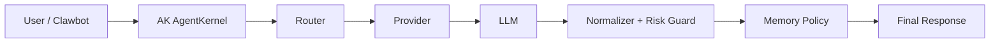

# AK-project AgentKernel

AK-project is a repository-owned AgentKernel layer that sits between an app and an interchangeable LLM.
It keeps identity, response structure, memory policy, and risk boundaries stable even when the model backend changes.

## What AK does
- loads repository-owned identity and operating rules
- routes requests through a provider-agnostic kernel
- normalizes responses into a stable structure
- applies risk checks and memory policy before returning output
- stays ready for minimal OpenClaw / Clawbot integration

## System flow



## Quick start

### 1. Install and verify
```bash
npm install
npm run build
npm run test:unit
npm run eval:consistency
```

### 2. Run the kernel directly
```ts
import { runAgentKernel } from './src/agentKernel';

const result = await runAgentKernel({
  userMessage: 'Build a compact integration plan.',
  preferredProvider: 'local'
});

console.log(result.normalizedResponse);
console.log(result.logs);
```

### 3. Run through the OpenClaw adapter
```ts
import { handleClawbotTurn } from './src/openclawAdapter';

const turn = await handleClawbotTurn({
  sessionId: 'session-1',
  channelId: 'discord',
  providerPreference: 'local',
  messages: [
    { role: 'assistant', content: 'How can I help?' },
    { role: 'user', content: 'Build a compact plan.' }
  ]
});

console.log(turn.reply.content);
console.log(turn.reply.debug);
```

## OpenClaw integration flow
1. Keep the existing channel or gateway runtime unchanged.
2. Map the incoming Clawbot session into `KernelInput` with `mapClawbotSessionToKernelInput()`.
3. Call `runAgentKernel()` through `handleClawbotTurn()`.
4. Return `KernelOutput` to the bot transport with `mapKernelOutputToClawbotReply()`.
5. Inspect `reply.debug`, `kernel.logs`, `riskFlags`, and `memoryWrites` during rollout.

If you want a reusable onboarding path for teams, install the bundled [`skills/clawbot-onboarding`](skills/clawbot-onboarding/SKILL.md) skill and follow its step-by-step integration checklist.

## Architecture docs
Detailed architecture is kept in `docs/`:
- [`docs/architecture/AK-system-overview.md`](docs/architecture/AK-system-overview.md)
- [`docs/architecture/AK-system-mindmap.md`](docs/architecture/AK-system-mindmap.md)
