# AK-project System Overview

This document summarizes the current repository-owned architecture for AK-project's verified phase 2 baseline.

- The **AgentKernel layer is implemented in this repository**.
- The **OpenClaw / Clawbot transport and session runtime are represented as an integration seam** via `src/openclawAdapter.ts`.
- The **provider layer is implemented as replaceable adapters**.
- **Persistence / retrieval is governed by policy today**, while durable storage remains an integration boundary rather than a full in-repo subsystem.

## Runtime flow

```mermaid
flowchart LR
    U[User]
    CG[Channel / Gateway\nexternal bot transport boundary]
    SC[Session / Conversation Layer\nOpenClaw / Clawbot session envelope]
    AK[AK-project / AgentKernel Layer\nrunAgentKernel + identity loading]
    MR[Model Routing Layer\nrouter + promptCompiler]
    PR[Providers\nlocal / cloud / fallback adapters]
    LLM[LLM Reasoning Layer\nreplaceable model backend]
    PG[Post-processing / Guard Layer\nresponseNormalizer + riskGuard]
    MG[Memory Governance Layer\nmemoryWriter + policy docs]
    PS[Persistence / Retrieval Layer\nrepo-governed boundary for approved memory]
    LO[Logging / Eval / Observability\nlogger + tests + eval/consistency]
    FR[Final Response]

    U --> CG --> SC --> AK --> MR --> PR --> LLM --> PG --> MG --> PS --> LO --> FR
    PG --> LO
    MG --> LO
    SC -. runtime mapping .-> AK
    AK -. normalized reply .-> SC
```

## Layer-by-layer explanation

### 1. User
The human input that begins a turn.

### 2. Channel / Gateway
The external delivery surface such as Discord, web chat, or another bot transport. This layer is **not implemented in this repository** and should remain unchanged when integrating AK-project.

### 3. Session / Conversation Layer
The runtime envelope that tracks session identifiers, channel identifiers, message history, and conversation state. In this repository, that boundary is represented by `src/openclawAdapter.ts`, which converts runtime session data into `KernelInput` and maps `KernelOutput` back into a bot reply shape.

### 4. AK-project / AgentKernel Layer
The stable identity and orchestration layer. `runAgentKernel()` loads the repository-owned identity bundle, chooses a provider path, invokes governance modules, and produces a stable `KernelOutput`.

### 5. Model Routing Layer
The deterministic layer that decides how the request should be handled before a provider is called. In the current baseline, this is primarily `src/router.ts` and `src/promptCompiler.ts`.

### 6. Providers
The interchangeable execution adapters for local, cloud, and fallback paths. These live in `src/providers/` and keep the reasoning backend replaceable.

### 7. LLM Reasoning Layer
The model backend itself. AK-project treats this as a replaceable reasoning engine rather than the source of identity.

### 8. Post-processing / Guard Layer
The normalization and safety wording layer that turns raw model output into the stable response contract and inspects wording for policy-sensitive content. In the current baseline, this is `src/responseNormalizer.ts` and `src/riskGuard.ts`.

### 9. Memory Governance Layer
The layer that decides what can be retained from a turn. In the current baseline, `src/memoryWriter.ts` enforces the repository policy that only user preference, verified fact, project state, and next action can be persisted, and that secrets/credentials must not be stored.

### 10. Persistence / Retrieval Layer
A governed boundary for approved memory storage and future retrieval. The repository currently defines the rules and extraction logic, but not a full durable store. This keeps the architecture honest to the phase 2 baseline without inventing storage systems that do not yet exist.

### 11. Logging / Eval / Observability
The inspectability layer. Runtime logs are produced via `src/logger.ts`, while repeatable verification lives in `tests/` and `eval/consistency/`.

### 12. Final Response
The normalized, structured reply returned back through the existing bot/session transport.

## Current repository mapping

- **Identity layer:** `identity/` and `src/identityLoader.ts`
- **Core orchestration:** `src/agentKernel.ts`
- **Routing + prompt compilation:** `src/router.ts`, `src/promptCompiler.ts`
- **Providers:** `src/providers/`
- **Normalization + risk:** `src/responseNormalizer.ts`, `src/riskGuard.ts`
- **Memory governance:** `src/memoryWriter.ts`
- **OpenClaw integration seam:** `src/openclawAdapter.ts`
- **Observability + evaluation:** `src/logger.ts`, `tests/`, `eval/consistency/`
